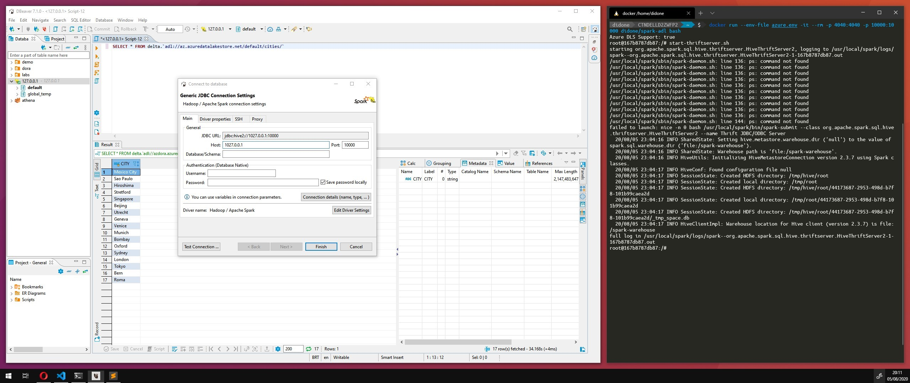

# Spark [Azure Data Lake](https://docs.microsoft.com/pt-br/azure/data-lake-store)

Disponível no repoistório padrão do [Docker Hub](https://hub.docker.com/r/didone/spark-adl), a imagem pode ser baixada atrés do comando:

```sh
docker pull didone/spark-adl
```

## Execução

Crie um arquivo `.env` para armazenar as credenciais da *Azure* que serão utilziadas pelo *Apache Spark* para conexão ao *Data Lake Storage*

```conf
AZ_CLIENT_ID=<your-oauth2-client-id>
AZ_CLIENT_SECRET=<your-oauth2-credential>
AZ_TOKEN_ENDPOINT=https://login.microsoftonline.com/<your-directory-id>/oauth2/token
```

Uma vez configuradas as chaves de acesso ao *cloud storage* você pode acessar o console (Spark Shell) com o comando abaixo:

```sh
docker run --env-file .env -it --rm -p 4040:4040 didone/spark-adl
```

```log
Spark context Web UI available at http://ff12ea874804:4040
Spark context available as 'sc' (master = local[*], app id = local-1596643921689).
Spark session available as 'spark'.
Welcome to
      ____              __
     / __/__  ___ _____/ /__
    _\ \/ _ \/ _ `/ __/  '_/
   /___/ .__/\_,_/_/ /_/\_\   version 3.0.0
      /_/

Using Scala version 2.12.10 (OpenJDK 64-Bit Server VM, Java 1.8.0_265)
Type in expressions to have them evaluated.
Type :help for more information.

scala>
```

O console do [Spark UI](http://localhost:4040) ficará acessível através da porta `4040` do seu *localhost*

### SQL

Para a execução de consultas pode ser utilizado o console `spark-sql`

```sh
docker run --env-file .env -it --rm -p 4040:4040 didone/spark-adl spark-sql
```

Ou então utilziar o *Thrift Server* para realizar consultas através de uma conexão *JDBC* no endereço `jdbc:hive2://127.0.0.1:10000/default`

```sh
docker run --env-file .env -it --rm -p 4040:4040 -p 10000:10000 didone/spark-adl bash
# Dentro do container
start-thriftserver.sh
```



> É necessário mapear a porta **10000** para que seja possível a conexão com o servidor *Thrift*

```sql
SELECT * FROM delta.`adl://my.azuredatalakestore.net/table`;
```

## Build

Caso queira fazer seu proprio build, execute o comando abaixo, a partir do diretório de checkout do projeto

```sh
docker image build -t <nome-da-sua-imagem> .
```
